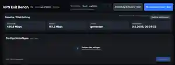

# VPN Exit Bench for Unraid

> [!WARNING]
> ## ⚠️ VIBE-CODED PROJECT
> **VPN Exit Bench was built primarily through AI-assisted / vibe coding.**
>
> The project is actively tested and reviewed, but it has **not** undergone a professional third-party security audit. Review the code before trusting it in a sensitive environment and **do not expose the WebUI directly to the public internet**.

[](LICENSE)

VPN Exit Bench is an **Unraid-native** tool for comparing WireGuard (`.conf`) and OpenVPN (`.ovpn`) VPN exit points for qBittorrent / torrent usage.

It is designed for **Unraid's normal Docker / Community Applications workflow**. Docker Compose is not required. Every selected VPN configuration is tested in a short-lived isolated Docker worker, so the Unraid host route itself is not changed.

---

## Screenshots

The screenshots below show the current WebUI with real benchmark data and cover the normal workflow from baseline/config selection through comparison and regional peering analysis.

### Dashboard, baseline and batch config selection



### Results, recommendation and multi-config comparison


### Europe peering map, matrix and regional measurements


---

## What VPN Exit Bench measures

VPN Exit Bench deliberately separates three questions:

1. **Raw VPN capacity** — how much download/upload throughput can this exit deliver?
2. **European peer connectivity** — how well does this exit reach typical European datacenter/seedbox regions?
3. **Torrent suitability** — which exit gives the best overall combination of speed, EU peering and stability for qBittorrent-oriented use?

The peer tests use public datacenter endpoints as a connectivity proxy. They do not connect to private tracker peers and cannot predict every real torrent swarm.

---

## Main features

- WireGuard and OpenVPN support
- upload/manage VPN configs directly from the WebUI
- isolated short-lived benchmark workers
- **Smart** and **Deep** benchmark modes
- Smart mode is the default for fast multi-config comparisons
- multi-select config checkboxes and sequential batch benchmarking
- stable selections while working through larger config sets
- direct internet baseline/reference measurements
- Raw Speed Score
- EU Peer Connectivity Score
- Torrent Score optimized for torrent/qBittorrent use
- two peer endpoints per region with regional aggregation/fallback handling
- reverse/download iPerf trust handling so broken reverse measurements do not unfairly destroy a score
- Proton NAT-PMP port-forwarding test
- manual forwarded-port support for providers such as OVPN
- port forwarding is informational and does **not** influence the Torrent Score
- live benchmark progress
- persistent local result history
- automatic best-to-worst comparisons
- interactive Europe peering map
- country-by-country peer matrix
- current build/version comparison against GitHub `main`
- runtime rejection of executable VPN config hooks
- CSRF protection
- optional HTTP Basic Authentication
- restricted Docker Socket Proxy deployment support

---

# Benchmark modes

## Smart — recommended default

**Smart** is intended for normal benchmarking and especially for comparing many VPN exits in one batch.

Smart mode:

- prechecks the Frankfurt and Amsterdam raw-speed reference paths;
- performs the full raw-speed measurement against the better reachable reference;
- uses shorter iPerf measurement windows;
- uses fewer ICMP samples;
- reduces retries where additional retries are unlikely to improve the result;
- still evaluates all seven EU peer regions;
- retains port-forwarding checks;
- can avoid unnecessary work when the useful ranking signal is already clear.

Use Smart when testing a provider's full server/config list or when regularly checking which exit is currently best.

## Deep — detailed finalist test

**Deep** spends more time collecting measurements and is intended for the strongest candidates after a Smart comparison.

A practical workflow is:

1. select all interesting configs;
2. run **Smart**;
3. compare the resulting Torrent Scores and regional matrix;
4. select the strongest few exits;
5. run **Deep** on those finalists.

This gives substantially faster large comparisons without giving up the option of a more exhaustive final measurement.

---

# Scoring model v5

The score intentionally gives European peer connectivity more influence than a simple speed test.

## Raw Speed Score

| Component | Weight |
|---|---:|
| Download | 60% |
| Upload | 40% |

Raw capacity is compared with the direct/reference measurement so different VPN exits are judged against the same local connection baseline.

Suspicious successful iPerf measurements below **20 Mbps** can be rechecked and evaluated using repeated samples/median handling. A single transient low measurement should therefore not ruin an otherwise strong result, while a genuinely slow route remains slow when repeated measurements agree.

## EU Peer Connectivity Score

Regions and weights:

| Region | Weight |
|---|---:|
| Netherlands | 25% |
| Germany | 25% |
| Switzerland | 20% |
| Denmark | 10% |
| Sweden | 10% |
| Poland | 5% |
| Romania | 5% |

Each regional score is composed of:

| Regional measurement | Weight |
|---|---:|
| Upload | 40% |
| Download | 25% |
| Latency | 20% |
| Packet loss / stability | 15% |

The final EU Peer Score is:

- **85%** weighted regional average
- **15%** worst measured regional score

The worst-region component prevents one or two excellent routes from completely hiding a badly connected destination.

### Reverse/download trust handling

Public iPerf infrastructure is imperfect. Some endpoints can produce a believable upload result but an obviously broken reverse/download result. When VPN Exit Bench marks a regional download measurement as untrustworthy, that download component is excluded from the regional score instead of treating the bogus value as real VPN performance. The remaining trustworthy upload, latency and loss measurements continue to contribute normally.

## Overall Torrent Score

| Component | Weight |
|---|---:|
| EU Peer Connectivity | 50% |
| Raw Speed | 40% |
| General Stability / Latency | 10% |

**Port forwarding has 0% score weight.** Its state remains visible because it matters operationally for torrenting, but open/mapped/closed/unknown port status cannot raise or lower the recommendation score.

The UI therefore keeps three concepts separate:

- **Speed Score** — raw VPN capacity
- **EU Peer Score** — connectivity toward European peer/seedbox proxy regions
- **Torrent Score** — combined torrent-oriented recommendation

---

# Batch benchmarking

Multiple VPN configs can be selected with checkboxes and benchmarked sequentially. This is useful when a provider offers many exit locations or multiple servers in the same country.

Selections remain stable while working through the list so configs can be compared as a group instead of starting every benchmark individually. Smart mode is the recommended choice for these larger batches.

Results can then be compared best-to-worst by the relevant metric rather than relying only on headline download speed.

---

# Europe peering view

The comparison view visualizes regional connectivity for each selected provider/config.

- stronger routes are visually distinguished from weaker routes;
- country nodes expose the regional scores;
- provider/config tabs separate exits cleanly;
- the adjacent matrix makes regional strengths and weaknesses easy to compare.

The map is a visualization of the measured public datacenter routes, not a literal map of torrent peers.

---

# Build/version status

The WebUI exposes build information and can compare the running build SHA with the current GitHub `main` state. This makes it easier to see whether the installed container is running the current project revision after new images are published.

---

# Unraid installation

Docker image:

```text
ghcr.io/mlo-tek/vpn-exit-bench:latest
```

Unraid XML template:

```text
https://raw.githubusercontent.com/mlo-Tek/VPN-Exit-Bench/main/unraid/vpn-exit-bench.xml
```

Default appdata:

```text
/mnt/cache/appdata/vpn-exit-bench
```

Default WebUI:

```text
http://UNRAID-IP:8787
```

> [!IMPORTANT]
> Keep port `8787` on a trusted LAN/management network. Do not directly port-forward it and do not treat the application as an internet-facing service.

---

## Authentication

The Unraid template exposes optional `AUTH_USERNAME` and `AUTH_PASSWORD`. Set **both** to enable HTTP Basic Authentication. If both are empty, authentication is disabled for backwards compatibility.

> [!CAUTION]
> HTTP Basic Authentication is authentication, not encryption. Over plain HTTP the credentials can be intercepted. Use it only on a trusted LAN or behind a trusted HTTPS reverse proxy/TLS endpoint. Direct public internet exposure is still not recommended.

CSRF protection for state-changing API requests is enabled independently of Basic Authentication.

---

# Recommended Docker access: Socket Proxy

Direct access to `/var/run/docker.sock` is effectively privileged host access if the application is compromised. New installations should therefore use the restricted Docker Socket Proxy layout:

```text
Browser/LAN
   │
   ▼
VPN Exit Bench
   │  restricted Docker HTTP API
   ▼
vpn-exit-bench-socket-proxy
   │
   ▼
/var/run/docker.sock
```

Create the private network once:

```bash
docker network create vpn-exit-bench
```

Socket Proxy template:

```text
https://raw.githubusercontent.com/mlo-Tek/VPN-Exit-Bench/main/unraid/vpn-exit-bench-socket-proxy.xml
```

Configure VPN Exit Bench to use the custom `vpn-exit-bench` network and set:

```text
DOCKER_HOST=tcp://vpn-exit-bench-socket-proxy:2375
```

Then remove the main container's `/var/run/docker.sock` mapping. Existing installations can continue using the direct socket mapping for compatibility, but the proxy layout reduces host-impact risk.

---

## Worker isolation

Each benchmark worker:

- does **not** receive the Docker socket;
- receives only the selected VPN config as a read-only mount;
- drops the normal Docker capability set;
- receives only the networking capabilities required by the benchmark;
- uses `no-new-privileges`;
- has a PID limit;
- receives `/dev/net/tun`;
- is removed after the benchmark.

This is isolation, not a formal sandbox guarantee.

---

## VPN config storage

Configs are stored below:

```text
/mnt/cache/appdata/vpn-exit-bench/vpns/
```

Example:

```text
/mnt/cache/appdata/vpn-exit-bench/vpns/Proton/proton-de.conf
/mnt/cache/appdata/vpn-exit-bench/vpns/Proton/proton-nl.conf
/mnt/cache/appdata/vpn-exit-bench/vpns/OVPN/ovpn-ch.conf
```

The first directory level becomes the provider name in the UI.

> [!CAUTION]
> WireGuard and OpenVPN configs frequently contain private keys, certificates or credentials. Never commit real VPN configs to GitHub and do not share them publicly.

---

## VPN config execution protection

VPN Exit Bench rejects unnecessary executable/control hooks such as WireGuard `PreUp`, `PostUp`, `PreDown`, `PostDown` and OpenVPN script/plugin/management directives.

Validation occurs when a config is uploaded and again inside the worker immediately before execution. The worker-side validation also protects configs copied manually into appdata.

---

# Security and privacy

The worker temporarily determines the direct public IP to verify that the VPN changed the egress route. Current versions do not persist or return the pre-VPN public IP and scrub it from older local result payloads at startup. VPN exit IPs remain in local results because they identify the exits being compared.

External benchmark services naturally see the source IP used for each request. During a direct baseline this can be the normal internet address; during VPN measurements it should normally be the VPN exit.

The WebUI includes CSRF protection, browser security headers, Content Security Policy protections and no-store API responses. The project also rejects executable VPN config hooks and keeps common key/config formats out of normal Git/Docker build contexts.

See [PRIVACY.md](PRIVACY.md), [SECURITY.md](SECURITY.md) and [CONTRIBUTING.md](CONTRIBUTING.md) for details.

---

# Automated security checks

The repository includes CodeQL, pip-audit, Bandit, Trivy scanning, Dependency Review, Dependabot, pinned GitHub Actions and GHCR image SBOM/provenance metadata.

Security automation reduces risk but does not replace code review or an independent audit.

---

## OpenVPN note

If an `.ovpn` file references separate local CA/certificate/key files, those files are not automatically mounted into the worker. Provider configs work best when required certificates/keys are embedded in the `.ovpn` file itself.

Executable OpenVPN script/plugin/management hooks are intentionally unsupported.

---

## Data persistence

Persistent data lives under `/config`, normally backed by:

```text
/mnt/cache/appdata/vpn-exit-bench
```

This includes uploaded VPN configs and `results.db`. Recreating the Docker container does not remove these files while the appdata mapping remains intact.

---

# Project files

- [CHANGELOG.md](CHANGELOG.md)
- [CONTRIBUTING.md](CONTRIBUTING.md)
- [SECURITY.md](SECURITY.md)
- [PRIVACY.md](PRIVACY.md)
- [MIT License](LICENSE)

The project is under active development. Benchmark endpoints and scoring can change as more real-world measurements are collected.

VPN Exit Bench is released under the **MIT License**.
